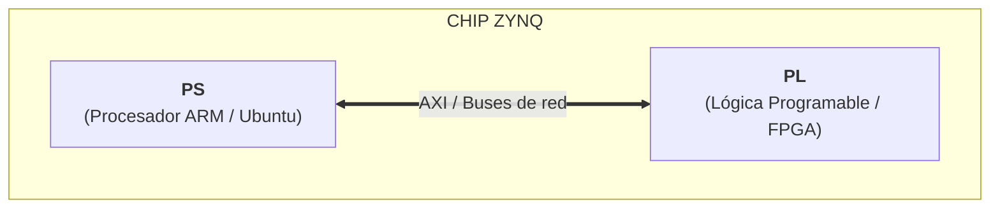

# 02. Conceptos Clave de PYNQ

Para trabajar con PYNQ sin renegar, es fundamental entender qué hay dentro del chip y cómo se conecta el código Python con el hardware programable. PYNQ no es una Raspberry Pi ni un microcontrolador tradicional; es una plataforma basada en la arquitectura **Xilinx Zynq**, que combina un procesador convencional con una FPGA.

---

## 1. La Dualidad del Chip Zynq: PS vs. PL

El corazón de la placa se divide en dos grandes bloques dentro del mismo circuito integrado:

* **PS (Processing System):** Es un procesador ARM de doble núcleo que ejecuta un sistema operativo Linux (Ubuntu). Acá corre el servidor de Jupyter Notebook, las librerías de Python y tus scripts. Se comporta como una computadora tradicional.
* **PL (Programmable Logic):** Es la matriz de lógica programable (la FPGA propiamente dicha). A diferencia del PS, acá no hay instrucciones ejecutándose secuencialmente: hay bloques digitales (LUTS, flip-flops, DSPs, BRAM) que se interconectan para formar hardware a medida.



---

## 2. ¿Qué es un Overlay?

En PYNQ, el diseño en la FPGA se maneja como si fuera una librería de software. Un **Overlay** es un diseño de hardware previamente sintetizado que se descarga en la PL para agregarle periféricos o aceleradores al sistema.

Para cargar un Overlay en Python, PYNQ utiliza principalmente dos archivos generados desde Vivado:

1. **`.bit` (Bitstream):** Contiene la configuración binaria que "moldea" las conexiones físicas dentro de la FPGA.
2. **`.hwh` (Hardware Handshake) o `.tcl`:** Contiene los metadatos del diseño. Le dice a Python qué IP cores existen en el bitstream, en qué direcciones de memoria están asignados y cómo interactuar con ellos.

### Carga en Python
Cuando ejecutás esto en un notebook:

```python
from pynq import Overlay

overlay = Overlay("mi_diseno.bit")
```

Ocurren dos cosas en segundo plano:

1. El archivo .bit programa la PL de forma instantánea.

2. PYNQ lee el archivo .hwh y genera dinámicamente objetos de Python para controlar cada bloque del hardware.

## 3. Asignación de Memoria: DMA y pynq.allocate

El procesador (PS) y la FPGA (PL) comparten la memoria RAM del sistema (DDR). Sin embargo, Python maneja la memoria de forma dinámica y fragmentada, mientras que los bloques IP de la FPGA necesitan arreglos de datos en direcciones de memoria contiguas.

Para transferir vectores o bloques grandes de datos (por ejemplo, señales para procesar o imágenes) hacia la FPGA a alta velocidad vía DMA (Direct Memory Access) 

* NO se usan listas nativas de Python.
* Se utiliza la función pynq.allocate, que reserva memoria física contigua en el sistema (CMA - Contiguous Memory Allocator) y devuelve un array compatible con NumPy.

```python
import pynq
import numpy as np

# Reserva un buffer de 1024 enteros de 32 bits en memoria contigua
buffer_entrada = pynq.allocate(shape=(1024,), dtype=np.int32)
```

## 4. Drivers de IP y Abstracción de Hardware

PYNQ mapea automáticamente los bloques IP integrados en la PL a clases de Python.

* **IPs estándar**: Periféricos comunes como GPIOs (para LEDs, botones y switches), Clocks, AXIDMA y AXI-Lite son reconocidos automáticamente por PYNQ mediante drivers nativos.

* **IPs personalizados**: Si diseñás un módulo propio en Vivado (por ejemplo, un filtro FIR o una FFT), podés acceder a sus registros de memoria usando el atributo .mmio (Memory-Mapped I/O) o escribir tu propio driver personalizado en Python extendiendo la clase DefaultIP.

## Resumen para el laboratorio

* Tu código Python corre en el PS (ARM/Linux).

* Los aceleradores o procesadores de señales corren en paralelo en la PL (FPGA).

* Los Overlays (.bit + .hwh) son la interfaz entre ambos mundos.

* Para procesar arreglos de datos a alta velocidad con la PL, usá siempre pynq.allocate.
---

[← Anterior: 01. Qué es PYNQ](./01_que_es_pynq.md) | [Siguiente: 03. Qué hace falta →](./03_que_hace_falta.md)