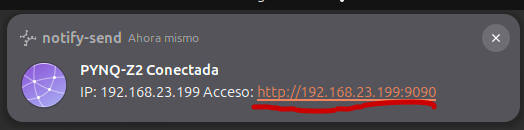
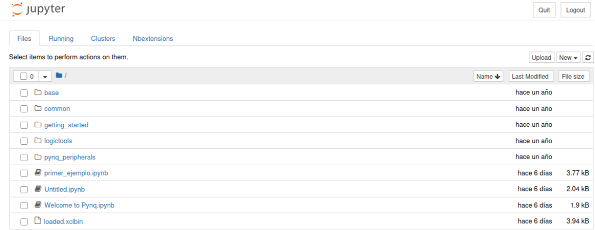
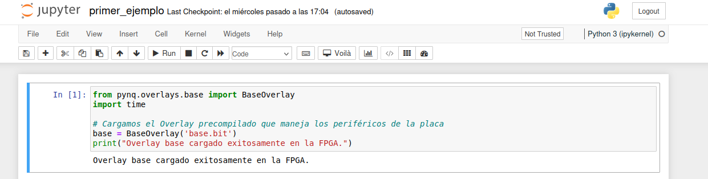

# 5. Guía Rápida de Uso: Jupyter Notebook en PYNQ-Z2

Esta guía cubre el funcionamiento básico de la interfaz de **Jupyter Notebook**, pensada para que cualquier usuario pueda desenvolverse con fluidez sin depender de experiencia previa con el entorno.

---

## 1. ¿Qué es Jupyter Notebook y cómo se accede?

Un **Jupyter Notebook** es un documento interactivo que combina código ejecutable en Python, texto explicativo (en formato Markdown), imágenes y ecuaciones en un solo lugar.

Para acceder desde tu navegador web:
1. Asegúrate de estar conectado a la red de la placa (vía Ethernet o Router).
2. Ingresa la dirección correspondiente en la barra de direcciones:
   * **Por IP fija (Conexión directa):** `http://192.168.2.99:9090`
   * **Por nombre mDNS:** `http://pynq:9090`
   * **Por programa "Identificador PYNQ":** Haga doble click sobre el archivo en el escritorio llamado Identificador PYNQ y déjelo corriendo. Cuando la placa se conecte a la red, le llegará una notificación en el escritorio de que el PYNQ está listo y solo debe hacer click en el link que sale en la notificación. Finalmente, ya puede cerrar el programa. 
3. Cuando solicite clave, ingresa la contraseña por defecto: `xilinx`.

---

## 2. La Interfaz Principal (Panel de Archivos)

Al ingresar, verás el administrador de archivos del sistema Linux de la placa:

* **Navegación:** Puedes hacer clic en las carpetas para explorarlas (por ejemplo, la carpeta `base` contiene ejemplos oficiales de la PYNQ).
* **Crear un nuevo notebook:** En la esquina superior derecha, haz clic en **New** -> **Python 3 (ipykernel)**.
* **Renombrar un notebook:** Dentro de un notebook, haz clic sobre el título (por defecto dice *Untitled*) en la parte superior izquierda y asigna el nombre deseado.

---

## 3. El Concepto Clave: Las Celdas

Un notebook se organiza en **celdas de trabajo**. Existen dos tipos principales de celdas:

1. **Celdas de Código (`Code`):**
   * Contienen líneas de código Python.
   * Se identifican porque tienen un corchete a la izquierda: `In [ ]:`.
   **Ejemplo** 
2. **Celdas de Texto (`Markdown`):**
   * Sirven para escribir documentación, títulos, listas y explicaciones.
   * Puedes cambiar el tipo de celda seleccionándola y usando el menú desplegable en la barra de herramientas superior (cambiando entre *Code* y *Markdown*).
   **Ejemplo** 

---

## 4. Flujo de Ejecución y Orden del Kernel

A diferencia de un script de Python tradicional que se ejecuta de arriba a abajo en bloque, en Jupyter **las celdas se ejecutan individualmente**.

### Indicadores a la izquierda de la celda:
* **`In [ ]:`** (Vacío): La celda **no se ha ejecutado** todavía en la sesión actual.
* **`In [*]:`** (Asterisco): La celda está **en proceso de ejecución**. Si estás cargando un Overlay grande (como `base.bit`), el asterisco indicará que el procesador está trabajando.
* **`In [1]:`** (Número): La celda **ya se ejecutó**. El número indica el orden secuencial de ejecución en el kernel.

> **Regla de oro:** El orden en que ejecutas las celdas importa. Si la Celda 2 usa una variable que se creó en la Celda 1, **debes ejecutar la Celda 1 primero**, de lo contrario obtendrás un error de tipo `NameError`.

---

## 5. Atajos de Teclado Fundamentales

Aprender estos atajos acelera drásticamente el flujo de trabajo:

| Acción | Atajo |
| :--- | :--- |
| **Ejecutar la celda actual** | `Shift + Enter` |
| **Ejecutar celda y crear una abajo** | `Alt + Enter` |
| **Insertar una celda ARRIBA** | Presionar `Esc` y luego la tecla `A` |
| **Insertar una celda ABAJO** | Presionar `Esc` y luego la tecla `B` |
| **Eliminar una celda** | Presionar `Esc` y luego presionar `D` dos veces (`D` + `D`) |
| **Cambiar celda a Texto (Markdown)** | Presionar `Esc` y luego la tecla `M` |
| **Cambiar celda a Código (Python)** | Presionar `Esc` y luego la tecla `Y` |

---

## 6. Manejo del Kernel (Qué hacer si se traba o da error)

El **Kernel** es el motor de Python que corre de fondo en la placa procesando el código. Si tu código entra en un bucle infinito o las variables se vuelven inestables:

1. **Interrumpir ejecución (Detener):**
   * Haz clic en el botón de **Stop (cuadrado negro)** en la barra superior o ve al menú `Kernel` -> `Interrupt`. Detiene la celda que esté corriendo en ese momento.
2. **Reiniciar Kernel (Borrar memoria):**
   * Ve al menú `Kernel` -> `Restart`. Esto limpia la memoria del procesador (las variables dejan de existir), pero no borra el texto ni el código escrito. Ideal cuando quieras empezar de cero.
3. **Reiniciar y ejecutar todo:**
   * Ve al menú `Kernel` -> `Restart & Run All`. Reinicia la memoria y ejecuta de forma secuencial todas las celdas desde la primera hasta la última.
