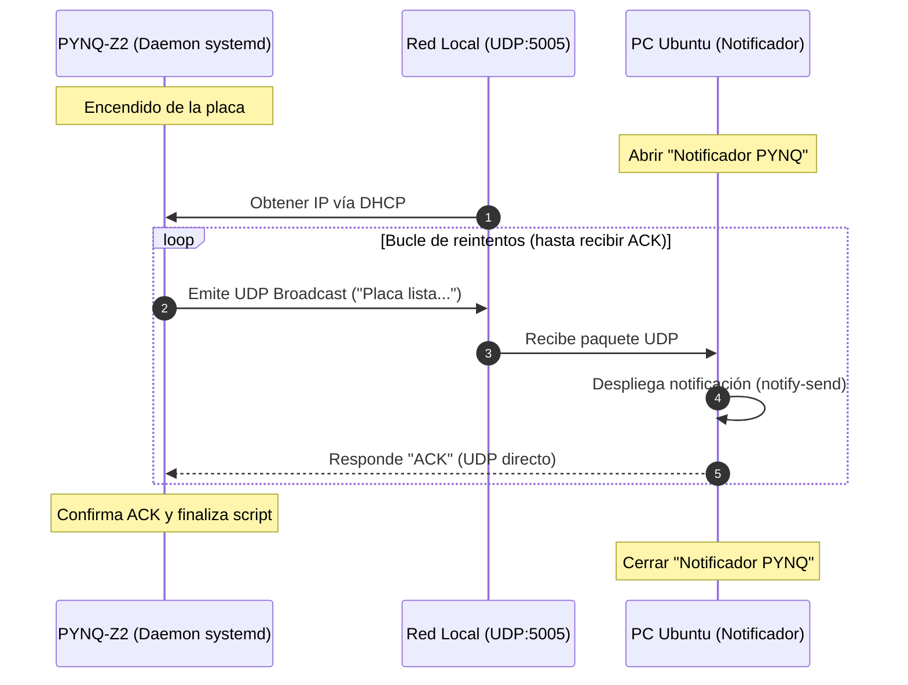

# Programa para encontrar y acceder a la PYNQ

Este programa se realizó con el objetivo de encontrar la direccion IP que le otorga el servicio DHCP del router a la PYNQ-Z2 en un entorno donde no se puede acceder al router ni al PYNQ mediante Serial y conectarse al dispositivo. 

## Requisitos

Hardware:

    Placa PYNQ-Z2 conectada a la misma red local (LAN/Wi-Fi) que la PC.

    PC con sistema operativo Linux (Ubuntu / Debian).

Software y Librerías:

    Python 3.x (utiliza módulos nativos: socket, time, os).

    libnotify-bin (para el comando notify-send en Ubuntu).

    systemd (administrador de servicios de Linux en la PYNQ).

    PyInstaller (opcional, para compilar el ejecutable en la PC).

## Diagrama en bloques y funcionamiento:

### 1. El PYNQ se enciende y obtiene la direccion IP por DHCP de la red local
### 2. El PYNQ emite un broadcast a la red local. El datagrama que se envia contiene la direccion IP que obtuvo la PYNQ.
### 3. La PC, conectada a la red, recibe el mensaje a traves del programa "Notificador PYNQ"
### 4. El programa "Notificador PYNQ" envía una notificación al usuario, con el enlace para conectarse a la PYNQ por navegador web.
### 5. El programa "Notificador PYNQ" le responde a la placa PYNQ que recibio su mensaje.
### 6. La PYNQ confirma el ACK y termina el script.
### 7. Finalmente, se puede cerrar el programa en la PC

## Especificaciones del protocolo de Red utilizado:

### Protocolo: UDP

### Puerto utilizado: 5005

### Formato del mensaje enviado: Placa PYNQ-Z2 lista. Acceso: [LINK A LA PYNQ]

### Mensaje de confirmación: Se usa la cadena de texto ACK

### Tolerancia a fallos:  Bucle de reintentos (30 intentos cada 2 segundos) y tiempo de espera de socket (timeout) de 2.0s.

## Guia de instalación

### Para la PYNQ-Z2
1.  Copia del script Programa_PYNQ.py en /home/xilinx/.

2. Abre el terminal de la PYNQ

3. Ejecuta el siguiente comando:

        sudo nano /etc/systemd/system/notificar-ip.service
        (Puede pedir contraseña. Por defecto es xilinx)
4. Escribe en el archivo de texto creado lo siguiente:
        
        [Unit]
        Description=Notificar IP de PYNQ via Broadcast UDP
        After=network-online.target wpa_supplicant.service
        Wants=network-online.target

        [Service]
        Type=oneshot
        User=xilinx
        ExecStart=/usr/bin/python3 /home/xilinx/Programa_PNYQ.py

        [Install]
        WantedBy=multi-user.target
        sudo systemctl daemon-reload      
        ExecStartPre=/bin/sleep 5
        sudo systemctl enable notificar-ip.service

5. Guarda los cambios con CTRL+O, ENTER y sal del editor de textos con CTRL+X

6. Crea y habilita el servicio con los siguientes comandos en consola: 
    
        sudo systemctl daemon-reload
        sudo systemctl enable notificar-ip.service 

Para tener una idea, systemd es el "administrador del sistema" en Linux (el encargado de encender los componentes del sistema operativo en orden). Nosotros creamos un archivo de configuración llamado notificar-ip.service y le dijimos a systemd: 
#### Cuándo actuar: "Espera a que los servicios de red estén listos (After=network-online.target)".

#### Qué ejecutar: "Corre en segundo plano el comando /usr/bin/python3 /home/xilinx/notificar_ip.py".

#### Cómo reaccionar ante errores: "Si falla porque la red todavía no entregó una IP, espera 10 segundos y vuelve a intentarlo (Restart=on-failure)".

Gracias a este daemon, la PYNQ ejecuta tu código en el instante exacto en que arranca Linux.

### Configuración en la PC

1. Bajar el script Programa_PC.py.

2. Compilar el binario con PyInstaller:

        pyinstaller --onefile --noconfirm --name "Notificador_PYNQ" Programa_PC.py
        
        Para que compile el archivo correctamente, el terminal debe estar en la ubicacion donde esta guardado el .py 

3. Entra a la carpeta dist que creo PyInstaller y otorga los permisos de ejecución.
        
        chmod +x Notificador_PYNQ
4. Crea un archivo de acceso directo en el Escritorio de Ubuntu

        nano ~/Escritorio/Notificador_PYNQ.desktop
5. Pega lo siguiente en el archivo de texto
        
        [Desktop Entry]
        Version=1.0
        Type=Application
        Name=Notificador PYNQ
        Comment=Escucha la IP Broadcast de la PYNQ-Z2
        Exec=/ruta/completa/a/tu/carpeta/dist/Notificador_PYNQ
        Terminal=true
        Icon=utilities-terminal
        Categories=Utility;

    #### En Exec, se debe colocar la ruta donde esta el archivo Notificador_PYNQ

6. Guarda con Ctrl + O, presiona Enter y sal con Ctrl + X.
7. En tu escritorio de Ubuntu, haz clic derecho sobre el nuevo icono Notificador_PYNQ.desktop y selecciona "Permitir lanzar" (Allow Launching).
8. Antes de probar encendiendo la PYNQ, asegúrate de que el firewall de Ubuntu no bloquee las conexiones UDP entrantes en el puerto 5005:
        
        sudo ufw allow 5005/udp