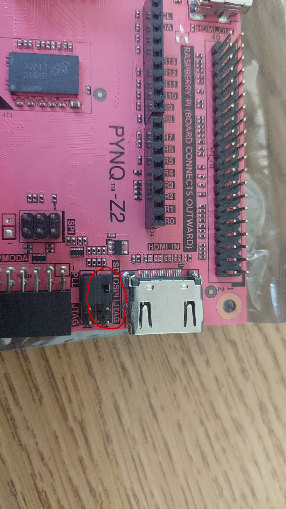
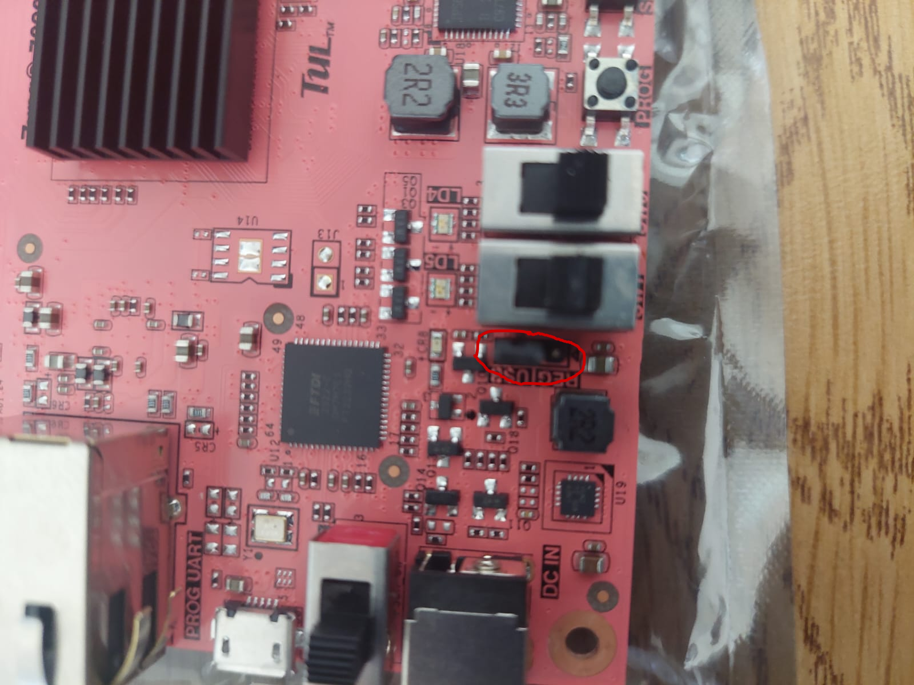

## Cambio de booteo y de alimentacion (v1.0 05/08/2026)

## 1. Jumper de Arranque (JP1 - Boot Mode)

**Ubicación en la placa:** Se encuentra cerca del centro superior de la placa, un poco a la izquierda del gran chip negro principal (el SoC Zynq) y justo al lado de las filas de pines del conector de expansión.

**Aspecto:** Es un conjunto de 4 pares de pines horizontales etiquetados con opciones como SD, QSPI y JTAG.

**Cómo configurarlo:** Para arrancar la placa desde la tarjeta MicroSD, debes colocar el puente plástico (jumper block) conectando los dos pines bajo la etiqueta SD.

---

## 2. Jumper de Alimentación (J9 / JP7 - Power Select)

**Ubicación en la placa:** Se encuentra en la esquina inferior izquierda, ubicado justo al lado de la entrada del conector jack de alimentación externa de 5V/12V y del puerto Micro-USB (marcado como PROG/UART).

**Aspecto:** Es un conjunto de 3 pines verticales con las etiquetas USB y REG.

**Cómo configurarlo:**
* **Modo USB:** Si vas a alimentar la placa directamente usando el cable Micro-USB conectado a tu computadora o cargador, coloca el puente plástico uniendo los pines marcados como USB.
* **Modo REG:** Si vas a usar una fuente de alimentación externa conectada al jack DC (transformador de pared), coloca el puente plástico en la posición REG.

